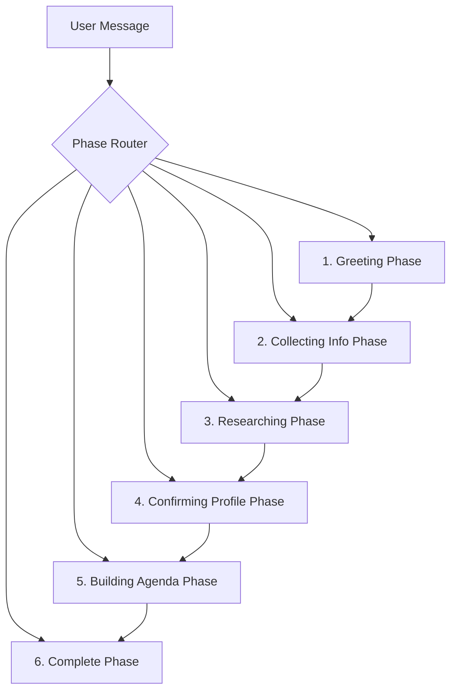

# How the Agenda Builder Agent Works - Step by Step

## Overview
The agenda builder is a sophisticated multi-phase AI agent system that researches users and creates personalized conference schedules. Here's exactly how it works:

## Architecture Components

### 1. **Orchestrator Singleton** (`/lib/agents/orchestrator-singleton.ts`)
- Maintains a single instance of the orchestrator across all requests
- Prevents multiple orchestrator instances from conflicting
- Manages conversation state persistence

### 2. **Agent Orchestrator** (`/lib/agents/orchestrator.ts`)
- **Core Brain**: Manages the entire conversation flow through distinct phases
- **State Management**: Tracks user info, research results, and conversation history
- **Phase Controller**: Moves conversations through 6 distinct phases

### 3. **User Profile Research Agent** (`/lib/agents/user-profile-researcher.ts`)
- Performs web searches about the user
- Infers professional interests and expertise
- Generates recommendations based on research

### 4. **Smart Agenda Builder** (`/lib/tools/schedule/smart-agenda-builder.ts`)
- Uses AI reasoning engine to select sessions
- Considers venue walking distances
- Resolves scheduling conflicts intelligently
- Leverages vector search for semantic matching

## Conversation Phases



## Detailed Phase Breakdown

### **Phase 1: Greeting** 🎯
**Trigger**: User accepts schedule building offer or explicitly asks for agenda
**What Happens**:
1. System detects agenda-related keywords ("build my schedule", "personalized agenda")
2. Checks if message already contains user info
3. Transitions to collecting_info phase

**Example Flow**:
```
User: "Yes, please build me a personalized schedule"
Bot: "I'd love to create a personalized agenda for you! I can research your background to make intelligent recommendations. To get started, could you tell me your full name, your company, your role/title?"
```

### **Phase 2: Collecting Info** 📝
**Purpose**: Gather name, company, and title
**What Happens**:
1. AI extracts user info from messages using Claude API
2. Tracks what's missing (name, company, title)
3. Asks for missing information
4. Once complete, moves to research phase

**Extraction Logic**:
- Uses Claude to intelligently parse messages
- Falls back to regex patterns if API fails
- Preserves partial info across messages

**Example**:
```
User: "I'm Nancy Paul from PS Advisory"
Bot: "Thanks! I still need your role/title. Could you provide this?"
User: "I'm the Managing Partner"
Bot: "Perfect! Let me research your background..."
```

### **Phase 3: Researching** 🔍
**Purpose**: Deep research on user's professional background
**What Happens**:
1. Performs web searches for:
   - LinkedIn profile
   - Company information
   - Recent news/projects
   - Industry context
2. Infers from research:
   - Professional interests
   - Expertise areas
   - Career goals
   - Experience level
3. Generates profile confidence score

**Research Components**:
- Web search API calls
- AI-powered inference engine
- Semantic analysis of findings
- Profile enrichment

### **Phase 4: Confirming Profile** ✅
**Purpose**: Validate research findings with user
**What Happens**:
1. Presents research summary to user
2. Asks for confirmation or adjustments
3. User can accept or provide corrections
4. Moves to agenda building when confirmed

**Example Output**:
```
Bot: "Based on my research, I found:
- You're focused on digital transformation
- Interest in AI and automation
- Leadership in advisory services
Does this look accurate?"
```

### **Phase 5: Building Agenda** 🗓️
**Purpose**: Create the personalized schedule
**What Happens**:

1. **Profile Integration**:
   - Uses research findings
   - Applies user preferences
   - Considers expertise level

2. **Session Selection Process**:
   ```typescript
   // AI Reasoning Engine considers:
   - User interests alignment
   - Professional goals
   - Company initiatives
   - Skill gaps to fill
   - Networking opportunities
   ```

3. **Vector Search Integration**:
   - Generates embeddings for user interests
   - Searches semantically similar sessions
   - Ranks by relevance score

4. **Conflict Resolution**:
   - Detects time conflicts
   - Uses AI to prioritize sessions
   - Considers venue walking distances
   - Suggests alternatives

5. **Schedule Optimization**:
   - Adds meal breaks
   - Ensures travel time between venues
   - Balances session load per day
   - Maximizes learning value

### **Phase 6: Complete** ✨
**Purpose**: Present final agenda and offer next steps
**What Happens**:
1. Formats agenda with reasoning
2. Offers save/export options
3. Allows modifications
4. Conversation can continue for adjustments

## Technical Integration Points

### 1. **Entry Points**
The agent can be triggered from:
- **Chat Stream Route** (`/app/api/chat/stream/route.ts`)
  - When user accepts schedule offer
  - When explicitly requesting agenda
- **Research Agent Route** (`/app/api/chat/research-agent/route.ts`)
  - Direct research agent invocation

### 2. **State Management**
```typescript
interface ConversationState {
  phase: ConversationPhase;
  userInfo: Partial<BasicUserInfo>;
  researchProfile?: EnrichedUserProfile;
  agendaBuilt: boolean;
  messages: Array<{role, content}>;
}
```

### 3. **Data Flow**
```
User Input → Orchestrator → Phase Handler → Research/Build → Response
     ↓             ↓              ↓              ↓            ↓
  Message    State Update    AI Processing   Database    Streaming
```

## Key Features

### 🧠 **Intelligence Layer**
- Uses Claude for natural language understanding
- AI reasoning engine for session selection
- Semantic search via vector embeddings
- Conflict resolution with AI judgment

### 🔄 **Persistence**
- Singleton orchestrator maintains state
- Session-based conversation tracking
- Profile caching for repeat users

### 🎯 **Personalization Factors**
1. **Professional Background**: Role, company, experience
2. **Inferred Interests**: From research and conversation
3. **Conference Goals**: Learning, networking, discovery
4. **Practical Constraints**: Time, location, preferences

### 📊 **Quality Metrics**
- Research confidence score (0-1)
- Data completeness percentage
- Session relevance scoring
- Alternative suggestions for conflicts

## Error Handling

The system gracefully handles failures at each phase:
- **Research Fails**: Falls back to manual preference collection
- **AI Extraction Fails**: Uses regex patterns
- **Agenda Build Fails**: Offers simpler agenda or manual selection
- **Validation Catches Empty Agendas**: Prevents save offers for failed generations

## Example Complete Flow

```
1. User: "Can you build me a personalized schedule?"
2. Bot: [Phase 1→2] "I'd love to! Tell me your name, company, and role?"
3. User: "I'm Sarah Chen, VP of Innovation at TechInsure"
4. Bot: [Phase 2→3] "Let me research your background..."
5. [Research occurs in background]
6. Bot: [Phase 3→4] "I found you focus on InsurTech innovation and AI. Correct?"
7. User: "Yes, that's right"
8. Bot: [Phase 4→5] "Building your personalized agenda..."
9. [AI builds schedule using all context]
10. Bot: [Phase 5→6] "Your agenda is ready! Here are your sessions..."
```

## Performance Optimizations

1. **Singleton Pattern**: One orchestrator instance serves all users
2. **Streaming Responses**: Real-time feedback during long operations
3. **Vector Search**: Fast semantic matching vs keyword search
4. **Caching**: Research results cached for session
5. **Parallel Processing**: Multiple searches run concurrently

## Future Enhancements

- [ ] Multi-attendee coordination
- [ ] Real-time session popularity adjustments
- [ ] Learning from user feedback
- [ ] Integration with calendar systems
- [ ] Mobile app deep linking